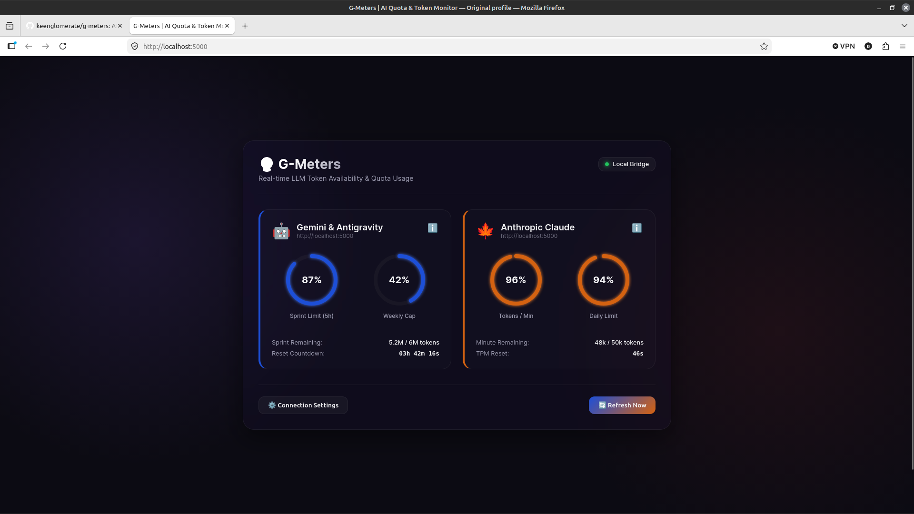

# 🔮 G-Meters: Multi-Model AI Quota & Token Monitor

A cross-platform, real-time widget designed to monitor token usage and API rate limits for **Google Antigravity/Gemini** and **Anthropic Claude**. 

The tool utilizes a hybrid architecture: it can connect to a secure **Local Bridge** on your machine or fall back to a **Serverless Cloud Proxy** to check your status safely without exposing credentials or bloating your main billing limits.

<p align="center">
  
</p>

---

## ✨ Features

- **Double Circular Progress Rings:** Renders remaining Sprint Limits and Weekly Baselines using SVG paths.
- **Micro-Animations:** Fluid glassmorphic UI card designs, pulsing connection states, and rotating refresh transitions.
- **Dual Connection Modes:** Attempts to sync via the Local Bridge, falling back to your Cloud Proxy URL if you are away from your development machine.
- **Multitasking Alert Details:** Expand detailed statistics for TPM (Tokens/Minute), RPM (Requests/Minute), and daily quotas.

## 🛠️ Installation & Setup

G-Meters is lightweight and designed to run with **zero external dependencies** on the host machine.

### 1. Clone the repository
```bash
git clone https://github.com/keenglomerate/g-meters.git
cd g-meters
```

### 2. Make the Daemon executable
Ensure the local Python script has execute permissions:
```bash
chmod +x daemon.py
```

### 3. (Optional) Redirect your client SDKs for free quota monitoring
To track your Anthropic Claude or Google Gemini limits for **zero extra tokens**, redirect your application's SDK base URLs to G-Meters:
- **Anthropic Python SDK:**
  ```python
  from anthropic import Anthropic
  client = Anthropic(
      api_key="your-api-key",
      base_url="http://localhost:5000"
  )
  ```
- **Gemini API / curl calls:**
  Redirect API requests from `https://generativelanguage.googleapis.com` to `http://localhost:5000`.

---

## 🚀 Getting Started

### 1. Launch the Local Bridge Daemon
Run the background server in your terminal:
```bash
./daemon.py
```
This starts the local web server and transparent API proxy at `http://localhost:5000`.

### 2. Open the Widget
Simply open **[http://localhost:5000](http://localhost:5000)** in any web browser to view your live quota dashboard! Alternatively, you can open the `index.html` file directly.


---

## 🔑 Fetching Live API Quotas

By default, if no keys are found, the daemon runs in **Simulation Mode** (demonstrating real-time updates and consumption changes).

To connect to live services:
1. Create a **`.env`** file inside the `g-meters` directory:
   ```env
   GEMINI_API_KEY="your-google-ai-studio-api-key"
   ANTHROPIC_API_KEY="your-anthropic-api-key"
   ```
2. Restart `daemon.py`. The local bridge will automatically pull live limits and remaining quotas directly from the provider headers!

---

## ⚡ Serverless Cloud Setup (Optional)
If you want to view your token widget on other platforms (like your smartphone or tablet) while away from your computer:
1. Copy the logic from `daemon.py` into a **Cloudflare Worker** or **Vercel Serverless Function**.
2. Store your API keys securely inside the cloud environment variables.
3. Pass the resulting worker URL into the **Connection Settings** popup panel inside the widget.
